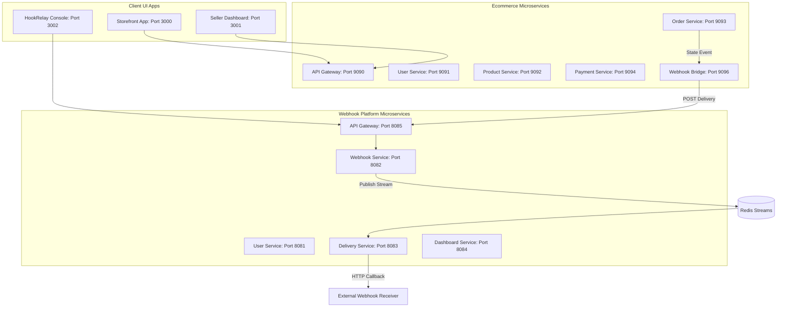

# Unified E-Commerce & Webhook Delivery Platform

A production-ready microservices architecture combining a modern multi-vendor E-Commerce system and a real-time Webhook delivery and monitoring engine (HookRelay clone).

This repository is split into two primary backend domains and a set of shared frontend client apps:
1.  **`Ecommerce-proj/`**: Features `user-service`, `product-service`, `order-service`, `payment-service`, `inventory-service`, and `webhook-bridge-service` with Razorpay checkout.
2.  **`Webhook-proj/`**: Features `user-service`, `webhook-service`, `delivery-service`, and `dashboard-service` with active event processing using Redis Streams.
3.  **`apps/`**: Contains three modern React (Vite + TailwindCSS) frontend applications:
    *   **Storefront (`apps/storefront`)**: Customer catalog, shopping cart, multi-address management, localized view options, and purchase checkouts.
    *   **Seller Dashboard (`apps/seller-dashboard`)**: Product registrations, sales analytics, coupon settings, and shipment dispatch controllers.
    *   **HookRelay Developer Console (`apps/hookrelay-console`)**: Webhook endpoint registrations, signing keys, and live delivery retry/DLQ status logs.

---

## 🔑 Recruiter & Guest Demo Accounts

To make it easy for recruiters and developers to test the live platform immediately without signing up, use the following **One-Click Autofill** credentials on each application's login page:

### 🛒 Customer Storefront
*   **Access Page**: [http://localhost:3000](http://localhost:3000)
*   **Email**: `recruiter.customer@example.com`
*   **Password**: `password123`

### 🏪 Seller Dashboard
*   **Access Page**: [http://localhost:3001](http://localhost:3001)
*   **Email**: `recruiter.seller@example.com`
*   **Password**: `password123`

### ⚙️ HookRelay Developer Console
*   **Access Page**: [http://localhost:3002](http://localhost:3002)
*   **Email**: `admin@auraretail.com`
*   **Password**: `AuraDevConsole2026!`

---

## 🏗️ Architecture Design & Flow



---

## ⚡ Quick Start (Local Run)

### Prerequisites
*   Docker & Docker Compose
*   Node.js (v18+)

### 1. Run the Backend Infrastructure
Navigate into the backend directories and start the docker compose stacks:

```bash
# Start E-Commerce backend stack
cd Ecommerce-proj
docker compose up -d

# Start Webhook platform stack
cd ../Webhook-proj
docker compose up -d
```

### 2. Start the Frontend Portals
Navigate back to the project root directory and run the following commands to boot up the frontends:

```bash
# Install dependencies
npm install

# Start development servers
npm run dev:storefront  # Client Storefront (Port 3000)
npm run dev:seller      # Seller Dashboard (Port 3001)
npm run dev:console     # HookRelay Console (Port 3002)
```

---

## 🔒 Security Configuration
All databases, JWT signing keys, and Razorpay APIs are parameterized. 
*   Template variables are documented inside `.env.example` in each backend folder.
*   Your local settings are kept safe inside untracked `.env` files matching `.gitignore` patterns.
